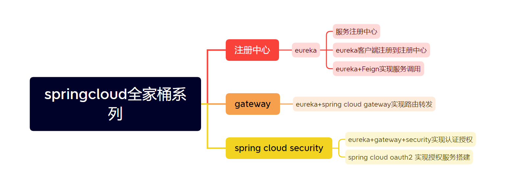

# springcloud-encyclopedia
spring cloud百科全书 

## 核心讲解顺序

| 内容                    | 说明                                                         |
| ----------------------- | ------------------------------------------------------------ |
| 1.1eureka 服务搭建      | eureka 搭建微服务注册中心                                    |
| 1.2eureka client 创建   | 微服务客户端创建（即我们常说的微服务，如：订单微服务、用户微服务、会员微服务...） |
| 2.1feign 微服务调用     | eureka 模式下使用feign实现微服务之间的调用                   |
| 3.1spring cloud gateway | eureka 模式下，使用网管实现请求的转发，解析spring cloud gateway配置（代码配置和yml配置） |

