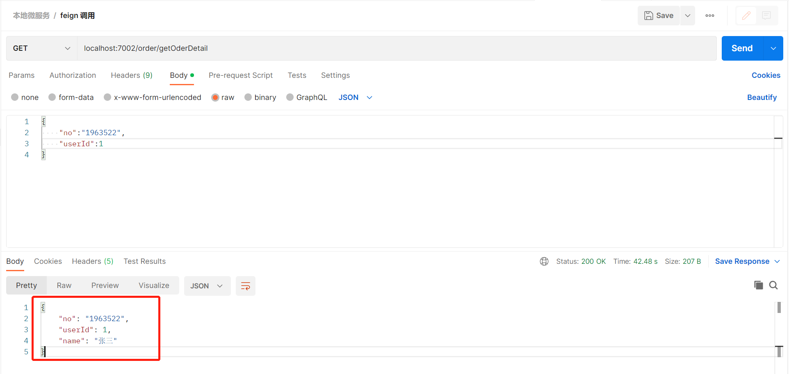

# springcloud-encyclopedia
spring cloud百科全书 


## 1.Eureka 应用搭建

### 1.1 Eureka server 注册中心搭建

步骤一：添加通用的父模块springcloud-base，在pom文件中添加springboot和springcloud和spring cloud alibaba通用的版本依赖以及通用的依赖

```java
<?xml version="1.0" encoding="UTF-8"?>
<project xmlns="http://maven.apache.org/POM/4.0.0"
         xmlns:xsi="http://www.w3.org/2001/XMLSchema-instance"
         xsi:schemaLocation="http://maven.apache.org/POM/4.0.0 http://maven.apache.org/xsd/maven-4.0.0.xsd">
    <modelVersion>4.0.0</modelVersion>

    <groupId>com.yf</groupId>
    <artifactId>springcloud-base</artifactId>
    <packaging>pom</packaging>
    <version>1.0-SNAPSHOT</version>
    <modules>
        <module>eureka-server</module>
        <module>eureka-client01</module>
        <module>eureka-client02</module>
    </modules>
    <name>springcloud-base</name>
    <description>spring cloud 基础工程</description>

    <properties>
        <maven.compiler.source>8</maven.compiler.source>
        <maven.compiler.target>8</maven.compiler.target>
        <java.version>1.8</java.version>
        <project.build.sourceEncoding>UTF-8</project.build.sourceEncoding>
        <spring-cloud.version>2021.0.4</spring-cloud.version>
        <spring-cloud-alibaba.version>2021.0.4.0</spring-cloud-alibaba.version>
        <spring-boot.version>2.6.11</spring-boot.version>
        <swagger.version>2.9.2</swagger.version>
    </properties>
    <dependencies>
        <!-- 每个微服务中都可能操作实体，所以将其添加到父工程中		-->
        <dependency>
            <groupId>org.projectlombok</groupId>
            <artifactId>lombok</artifactId>
            <optional>true</optional>
        </dependency>
        <!--  不加此依赖，在注入LoadBalancerClient的服务中启动会报错，因为微服务之间可能互相调用，所以将其添加到父工程的依赖中      -->
        <dependency>
            <groupId>org.springframework.cloud</groupId>
            <artifactId>spring-cloud-loadbalancer</artifactId>
        </dependency>

        <dependency>
            <groupId>com.alibaba.cloud</groupId>
            <artifactId>spring-cloud-starter-alibaba-nacos-config</artifactId>
        </dependency>

        <dependency>
            <groupId>org.springframework.cloud</groupId>
            <artifactId>spring-cloud-starter-bootstrap</artifactId>
        </dependency>

        <dependency>
            <groupId>io.springfox</groupId>
            <artifactId>springfox-swagger2</artifactId>
            <version>${swagger.version}</version>
        </dependency>
        <dependency>
            <groupId>io.springfox</groupId>
            <artifactId>springfox-swagger-ui</artifactId>
            <version>${swagger.version}</version>
        </dependency>

        <dependency>
            <groupId>com.alibaba</groupId>
            <artifactId>fastjson</artifactId>
            <version>2.0.18</version>
        </dependency>


        <dependency>
            <groupId>org.apache.commons</groupId>
            <artifactId>commons-pool2</artifactId>
        </dependency>

        <dependency>
            <groupId>cn.hutool</groupId>
            <artifactId>hutool-all</artifactId>
            <version>5.7.22</version>
        </dependency>
    </dependencies>
    <dependencyManagement>
        <dependencies>
            <!-- spring cloud版本管理依赖			-->
            <dependency>
                <groupId>org.springframework.cloud</groupId>
                <artifactId>spring-cloud-dependencies</artifactId>
                <version>${spring-cloud.version}</version>
                <type>pom</type>
                <scope>import</scope>
            </dependency>
            <!-- spring cloud alibaba版本管理依赖			-->
            <dependency>
                <groupId>com.alibaba.cloud</groupId>
                <artifactId>spring-cloud-alibaba-dependencies</artifactId>
                <version>${spring-cloud-alibaba.version}</version>
                <type>pom</type>
                <scope>import</scope>
            </dependency>
            <!-- spring boot 版本管理依赖			-->
            <dependency>
                <groupId>org.springframework.boot</groupId>
                <artifactId>spring-boot-dependencies</artifactId>
                <version>${spring-boot.version}</version>
                <type>pom</type>
                <scope>import</scope>
            </dependency>
        </dependencies>
    </dependencyManagement>

    <build>
        <plugins>
            <plugin>
                <groupId>org.springframework.boot</groupId>
                <artifactId>spring-boot-maven-plugin</artifactId>
                <configuration>
<!--                    <fork>true</fork>-->
                    <excludes>
                        <exclude>
                            <groupId>org.projectlombok</groupId>
                            <artifactId>lombok</artifactId>
                        </exclude>
                    </excludes>
                </configuration>
                <!--	加入这个配置才能打成可执行的jar			-->
                <executions>
                    <execution>
                        <goals>
                            <goal>repackage</goal>
                        </goals>
                    </execution>
                </executions>
            </plugin>

            <plugin>
                <groupId>org.apache.maven.plugins</groupId>
                <artifactId>maven-compiler-plugin</artifactId>
                <version>3.1</version>
                <configuration>
                    <source>${java.version}</source>
                    <target>${java.version}</target>
                    <encoding>${project.build.sourceEncoding}</encoding>
                </configuration>
            </plugin>
        </plugins>
    </build>
    <repositories>
        <repository>
            <id>public</id>
            <name>aliyun nexus</name>
            <url>https://maven.aliyun.com/repository/public</url>
            <releases>
                <enabled>true</enabled>
            </releases>
        </repository>
    </repositories>

    <pluginRepositories>
        <pluginRepository>
            <id>public</id>
            <name>aliyun nexus</name>
            <url>https://maven.aliyun.com/repository/public</url>
            <releases>
                <enabled>true</enabled>
            </releases>
            <snapshots>
                <enabled>false</enabled>
            </snapshots>
        </pluginRepository>
    </pluginRepositories>

</project>
```

步骤二：在通用的父模块下添加注册中心服务子模块eureka-server，在pom文件中引入如下依赖

```java
<dependencies>
        <!-- eureka-server 核心依赖jar  -->
        <dependency>
            <groupId>org.springframework.cloud</groupId>
            <artifactId>spring-cloud-starter-netflix-eureka-server</artifactId>
        </dependency>
        <!-- springboot测试依赖jar -->
        <dependency>
            <groupId>org.springframework.boot</groupId>
            <artifactId>spring-boot-starter-test</artifactId>
        </dependency>
    </dependencies>
```

步骤三：在eureka-server的resources目录下添加application.yml配置文件

```java
eureka:
  client:
    # 因为当前项目为服务，不需要向服务注册自己，默认为true
    register-with-eureka: false
    # 因为当前为非集群版eureka，所以不需要同步其他节点数据
    fetch-registry: false
# 当server.port配置不是8761时需要配置内容
    service-url:
      defaultZone: http://localhost:${server.port}/eureka/
server:
  port: 7001
```

步骤四：添加服务启动类EurekaServerApplication

```
package com.yf;

import org.springframework.boot.SpringApplication;
import org.springframework.boot.autoconfigure.SpringBootApplication;
import org.springframework.cloud.netflix.eureka.server.EnableEurekaServer;

/**
 * @projectName: eureka-server
 * @package: com.yf
 * @className: EurekaServerApplication
 * @author: yangfeng
 * @description: TODO
 * @date: 2022/12/13 11:04
 * @version: 1.0
 */
@SpringBootApplication
@EnableEurekaServer
public class EurekaServerApplication {
    public static void main(String[] args) {
        SpringApplication.run(EurekaServerApplication.class,args);
    }
}
```

**@EnableEurekaServer**指明这个是Eureka Server

步骤五：访问测试，在浏览器输入：localhost:7001,出现如下界面说明Eureka 注册中心搭建成功


### 1.2Eureka client01 客户端搭建

步骤一：新增子模块eureka-client01，pom文件添加依赖

```
<?xml version="1.0" encoding="UTF-8"?>
<project xmlns="http://maven.apache.org/POM/4.0.0"
         xmlns:xsi="http://www.w3.org/2001/XMLSchema-instance"
         xsi:schemaLocation="http://maven.apache.org/POM/4.0.0 http://maven.apache.org/xsd/maven-4.0.0.xsd">
    <parent>
        <artifactId>springcloud-base</artifactId>
        <groupId>com.yf</groupId>
        <version>1.0-SNAPSHOT</version>
    </parent>
    <modelVersion>4.0.0</modelVersion>

    <artifactId>eureka-client01</artifactId>

    <properties>
        <maven.compiler.source>8</maven.compiler.source>
        <maven.compiler.target>8</maven.compiler.target>
    </properties>

    <dependencies>
        <dependency>
            <groupId>org.springframework.cloud</groupId>
            <artifactId>spring-cloud-starter-netflix-eureka-client</artifactId>
        </dependency>

        <dependency>
            <groupId>org.springframework.boot</groupId>
            <artifactId>spring-boot-starter-web</artifactId>
        </dependency>

        <dependency>
            <groupId>org.springframework.boot</groupId>
            <artifactId>spring-boot-starter-test</artifactId>
        </dependency>
    </dependencies>

</project>
```

步骤二：添加配置文件

```java

eureka:
  client:
    #表示是否将自己注册进EurekaServer默认为true。
    register-with-eureka: true
    #是否从EurekaServer抓取已有的注册信息，默认为true。单节点无所谓，集群必须设置为true才能配合ribbon使用负载均衡
    fetchRegistry: true
    service-url:
      defaultZone: http://localhost:7001/eureka
server:
  port: 7002
spring:
  application:
    name: eureka-client01
```

步骤三：添加启动类

```
package com.yf;

import org.springframework.boot.SpringApplication;
import org.springframework.boot.autoconfigure.SpringBootApplication;
import org.springframework.cloud.netflix.eureka.EnableEurekaClient;

/**
 * @projectName: eureka-server
 * @package: com.yf
 * @className: EurekaClient01Application
 * @author: yangfeng
 * @description: TODO
 * @date: 2022/12/13 11:04
 * @version: 1.0
 */
@SpringBootApplication
@EnableEurekaClient
public class EurekaClient01Application {
    public static void main(String[] args) {
        SpringApplication.run(EurekaClient01Application.class,args);
    }
}
```

@EnableEurekaClient 标明是 Eureka 客户端

步骤四：启动测试

启动EurekaClient01Application，然后访问注册中心localhost:7001，如果在**Instances currently registered with Eureka**下面多出了刚才启动的客户端，说明客户端已经注册到了注册中心里面，接下来就能开启你的微服务之旅了

## 2.Feign+Eureka 微服务调用

**需求描述：**

eureka-client02作为服务提供者（provider）提供一个根据用户id查询用户信息的接口，eureka-client02作为服务的消费者（consumer），通过Feign调用eureka-client02中根据用户id查询用户信息的接口，然后返回订单详细信息（包含订单信息和用户信息）

**实现步骤：**

步骤一：eureka-client02中添加用户信息实体类SysUser

```
package com.yf.entity;

import lombok.Builder;
import lombok.Data;

/**
 * @projectName: springcloud-base
 * @package: com.yf.entity
 * @className: SysUser
 * @author: yangfeng
 * @description: TODO
 * @date: 2022/12/13 15:04
 * @version: 1.0
 */
@Data
@Builder
public class SysUser {
    private Integer id;

    private String name;
}
```

步骤二：添加UserService接口并添加根据id查询用户信息接口（用户信息查询map不走数据库）

```
package com.yf.service;

import com.yf.entity.SysUser;
import org.springframework.stereotype.Service;

import java.util.HashMap;
import java.util.Map;

/**
 * @projectName: springcloud-base
 * @package: com.yf.service
 * @className: UserService
 * @author: yangfeng
 * @description: TODO
 * @date: 2022/12/13 15:08
 * @version: 1.0
 */
@Service
public class UserService {
    private static final Map<Integer,SysUser> userDb = new HashMap<Integer, SysUser>();
    static {
        userDb.put(1,SysUser.builder().id(1).name("张三").build());
        userDb.put(2,SysUser.builder().id(1).name("李四").build());
        userDb.put(3,SysUser.builder().id(1).name("王五").build());
        userDb.put(4,SysUser.builder().id(1).name("赵六").build());
        userDb.put(5,SysUser.builder().id(1).name("小七").build());
    }

    public SysUser getUserById(Integer id){
        return userDb.get(id);
    }
}
```

步骤三：添加UserController

```
package com.yf.controller;

import com.yf.entity.SysUser;
import com.yf.service.UserService;
import org.springframework.beans.factory.annotation.Autowired;
import org.springframework.web.bind.annotation.GetMapping;
import org.springframework.web.bind.annotation.RequestMapping;
import org.springframework.web.bind.annotation.RestController;

/**
 * @projectName: springcloud-base
 * @package: com.yf.controller
 * @className: UserController
 * @author: yangfeng
 * @description: TODO
 * @date: 2022/12/13 15:13
 * @version: 1.0
 */
@RestController
@RequestMapping("/user")
public class UserController {
    @Autowired
    private UserService userService;
    @GetMapping("/getUserById")
    public SysUser getUserById(Integer id){
        return userService.getUserById(id);
    }
}

```

步骤四：eureka-client01的pom文件中添加openFeign依赖

```java
 <dependency>
     <groupId>org.springframework.cloud</groupId>
     <artifactId>spring-cloud-starter-openfeign</artifactId>
</dependency>
```

步骤五：eureka-client01包接口中添加feign包并添加UserRemoteService接口

```java
package com.yf.feign;

import com.yf.dto.UserDto;
import org.springframework.cloud.openfeign.FeignClient;
import org.springframework.web.bind.annotation.GetMapping;
import org.springframework.web.bind.annotation.RequestMapping;
import org.springframework.web.bind.annotation.RequestParam;

/**
 * @projectName: springcloud-base
 * @package: com.feign
 * @className: UserRemoteService
 * @author: yangfeng
 * @description: 用户服务service
 * @date: 2022/12/13 14:58
 * @version: 1.0
 */
@FeignClient("eureka-client02")
public interface UserRemoteService {
    @GetMapping("/user/getUserById")
    public UserDto getUserById(@RequestParam("id")Integer id);
}
```

步骤六：添加OrderService，在OrderService中调用UserRemoteService查询用户信息

```
package com.yf.service;

import com.yf.dto.OrderQueryDto;
import com.yf.dto.UserDto;
import com.yf.feign.UserRemoteService;
import com.yf.vo.OrderVo;
import org.springframework.beans.BeanUtils;
import org.springframework.stereotype.Service;

import javax.annotation.Resource;

/**
 * @projectName: springcloud-base
 * @package: com.yf.service
 * @className: OrderService
 * @author: yangfeng
 * @description: TODO
 * @date: 2022/12/13 15:17
 * @version: 1.0
 */
@Service
public class OrderService {

    @Resource
    private UserRemoteService userRemoteService;

    public OrderVo getOrderDetail(OrderQueryDto queryDto){
        UserDto userDto = userRemoteService.getUserById(queryDto.getUserId());
        OrderVo orderVo = new OrderVo();
        BeanUtils.copyProperties(queryDto,orderVo);
        orderVo.setName(userDto.getName());
        return orderVo;


    }
}
```

步骤七：添加OrderController

```
package com.yf.controller;

import com.yf.dto.OrderQueryDto;
import com.yf.service.OrderService;
import com.yf.vo.OrderVo;
import org.springframework.beans.factory.annotation.Autowired;
import org.springframework.web.bind.annotation.GetMapping;
import org.springframework.web.bind.annotation.RequestBody;
import org.springframework.web.bind.annotation.RequestMapping;
import org.springframework.web.bind.annotation.RestController;

/**
 * @projectName: springcloud-base
 * @package: com.yf.controller
 * @className: OrderController
 * @author: yangfeng
 * @description: TODO
 * @date: 2022/12/13 15:25
 * @version: 1.0
 */
@RestController
@RequestMapping("/order")
public class OrderController {
    @Autowired
    private OrderService orderService;
    @GetMapping("getOderDetail")
    public OrderVo getOrderDetail(@RequestBody OrderQueryDto queryDto){
        return orderService.getOrderDetail(queryDto);
    }

}
```

步骤八：使用postman测试，如果能返回订单以及用户的信息说明调用成功


