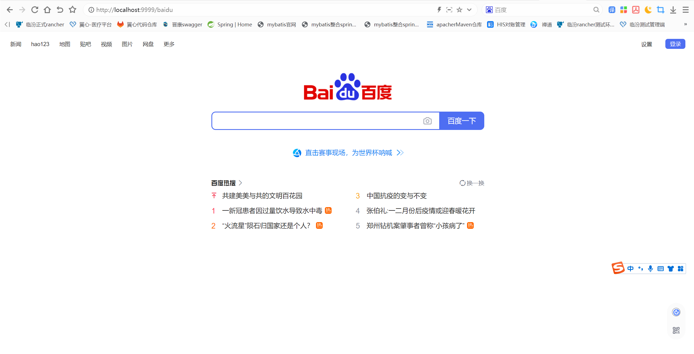
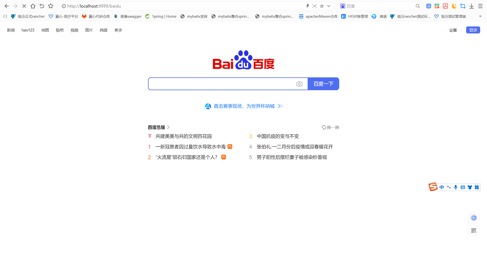
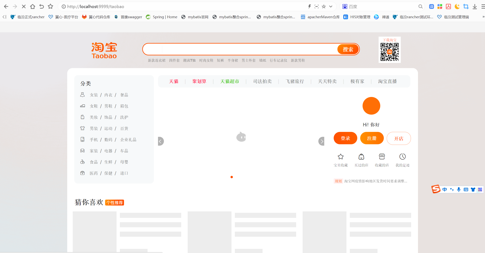

# 1.spring cloud gateway是什么？

SpringCloud Gateway 是 Spring Cloud 的一个全新项目，该项目是基于 Spring 5.0，Spring Boot 2.0 和 Project Reactor 等技术开发的网关，它旨在为微服务架构提供一种简单有效的统一的 API 路由管理方式。

# 2.spring cloud gateway能干什么？

为微服务架构提供一种简单有效的统一的 API 路由管理方式

## 2.1spring cloud gateway核心优势

- **简化客户端的工作**：网关将微服务封装起来后，客户端只需同网关交互，而不必调用各个不同服务
- **降低函数间的耦合度**： 一旦服务接口修改，只需修改网关的路由策略，不必修改每个调用该函数的客户端，从而减少了程序间的耦合性
- **解放开发人员把精力专注于业务逻辑的实现**:由网关统一实现服务路由(灰度与ABTest)、负载均衡、访问控制、流控熔断降级等非业务相关功能，而不需要每个服务 API 实现时都去考虑

# 3.how to do？

## 3.1需求

- 请求 /baidu 时转发到百度页面
- 请求/taobao 时转发到淘宝页面

## 3.2项目框架搭建

1. 访问https://start.spring.io/   Dependencies 添加gateway、resilience4j 、contract stub runner，点击“GENERATE”

2. 解压生成的项目，使用开发工具打开，我使用的是IDE（强烈推荐）

3. 在项目的resources目录下添加application.yml,在配置文件中添加端口和核心配置

   ```java
   # 设置网管端口，一般设置为9999，可以根据自己需求设置
   server:
     port: 9999
   #设置网管名称
   spring:
     application:
       name: spcloud-gateway
     cloud:
       gateway:
         routes:
           - id: gateway-to-baidu
             uri: http://www.baidu.com
             predicates:
             - Path=/baidu
             filters:
               # StripPrefix：去除原始请求路径中的前1级路径，即/gateway
               - StripPrefix=1 
   #设置注册中心地址
   eureka:
     client:
       service-url:
         defaultZone: http://localhost:7001/eureka
   
   logging:
     level:
       org.springframework.cloud.gateway: debug
   ```

4. 添加启动类并启动，在浏览器输入：localhost:9999/baidu,能成功跳转到百度页面说明路由配置成功

   

## 3.2通过代码配置gateway路由

在启动类所在的包结构下面添加RouteConfig配置类,并在该类中构建RouteLocator，添加路由转发的规则

```java
package com.yf.config;

import org.springframework.cloud.gateway.route.RouteLocator;
import org.springframework.cloud.gateway.route.builder.RouteLocatorBuilder;
import org.springframework.context.annotation.Bean;
import org.springframework.context.annotation.Configuration;

/**
 * @projectName: springcloud-base
 * @package: com.yf.config
 * @className: RouteConfig
 * @author: yangfeng
 * @description: TODO
 * @date: 2022/12/16 10:26
 * @version: 1.0
 */
@Configuration
public class RouteConfig {

    @Bean
    public RouteLocator myRoutes(RouteLocatorBuilder builder) {
        RouteLocatorBuilder.Builder routes = builder.routes();
        routes.route(p -> p.path("/taobao").filters(f ->f.stripPrefix(1)).uri("https://www.taobao.com"));
        routes.route(p -> p.path("/baidu").filters(f ->f.stripPrefix(1)).uri("https://www.baidu.com"));
        return routes.build();

    }
}
```

## 3.3启动测试

1. 在浏览器输入localhost:9999/baidu

   

2. 在浏览器输入localhost:9999/taobao

   

如上，说明spring cloud gateway基础的环境已经搭建成功。

## 4.spring cloud gateway 核心知识讲解

## 4.1 